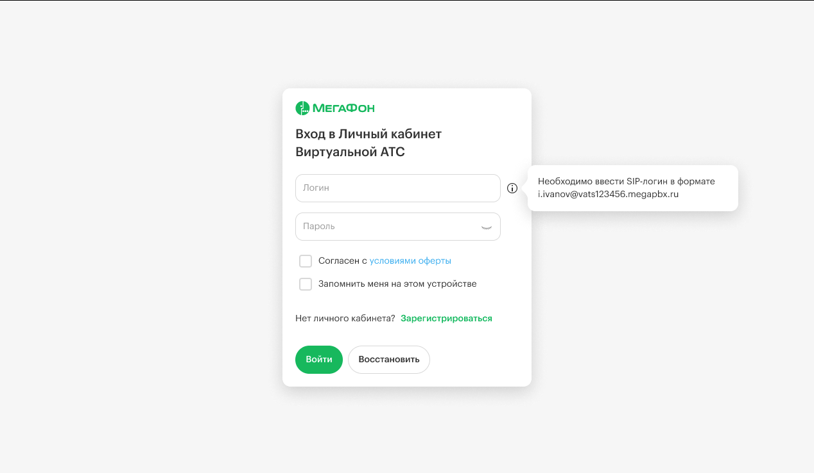
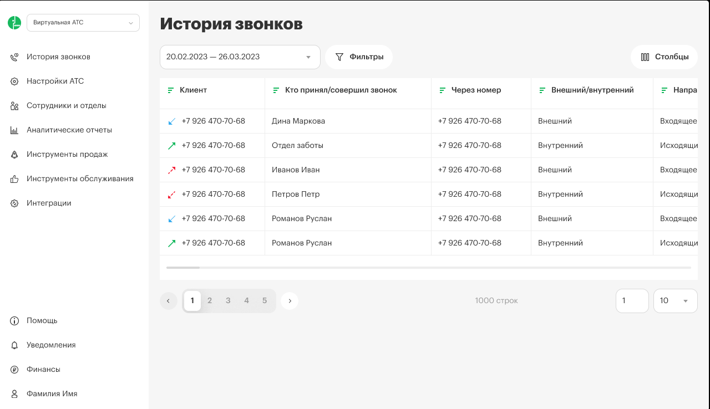
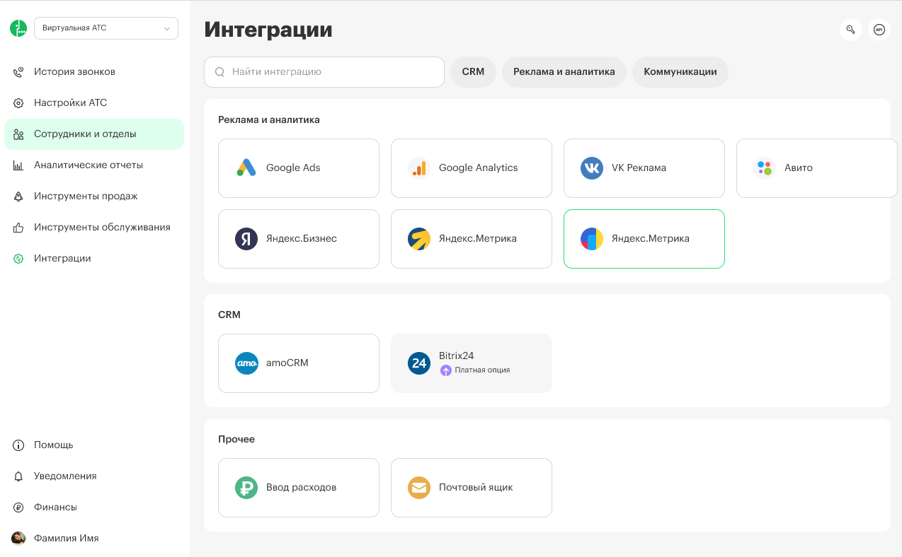
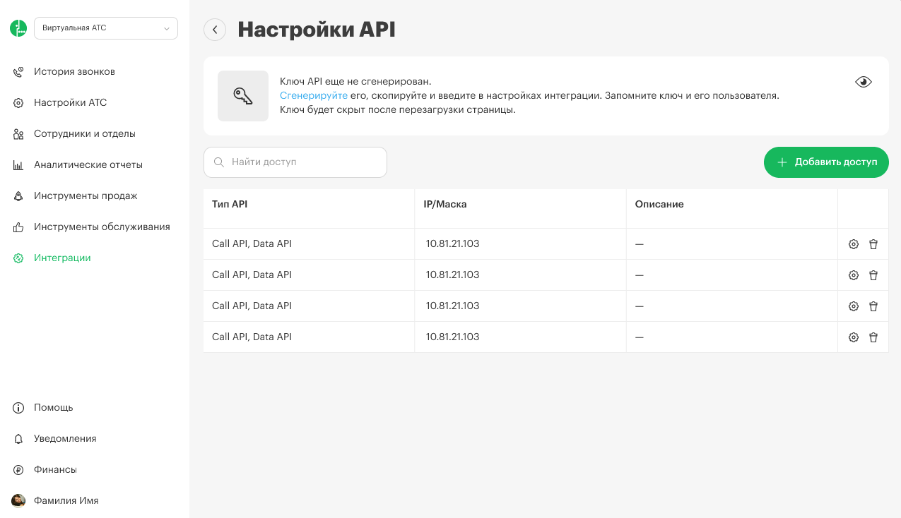
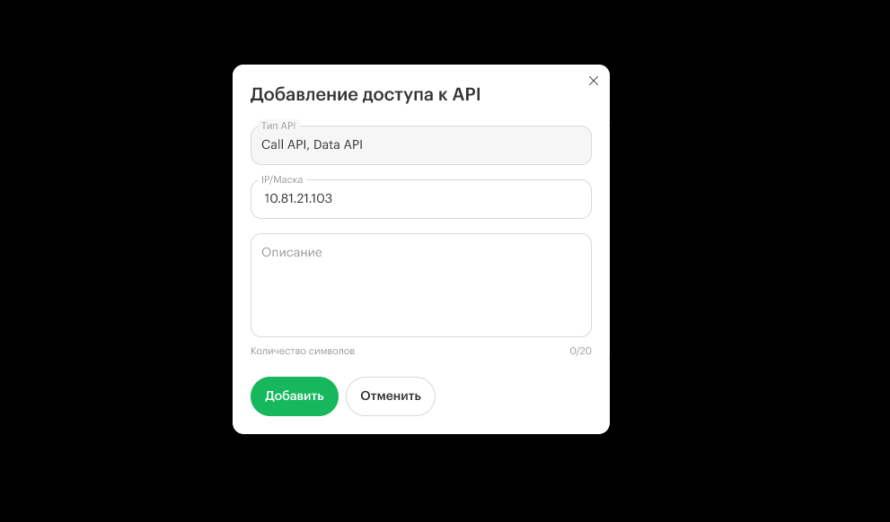

По умолчанию доступ к API запрещен для всех. Чтобы разрешить выполнение запросов, необходимо добавить IP-адрес хоста, с которого осуществляется запрос, в белый список. Это можно сделать через личный кабинет, перейдя в раздел **Интеграции -> API -> Настройка API**.

## Инструкция по настройке доступа к API

По умолчанию доступ к API запрещен для всех. Чтобы разрешить выполнение запросов, выполните следующие шаги:

#### **Вход в личный кабинет**

-  Войдите в свой личный кабинет.

   

#### **Переход в раздел интеграций**:

-  Найдите и выберите раздел **«Интеграции»**.

   

   

Затем щёлкните на кнопку API.

#### **Настройка API**

-  В разделе **«Настройка API»** найдите кнопку **«Добавить доступ»**.

Нажмите на нее, чтобы добавить IP-адрес.

#### **Добавление IP-адреса**

-  Введите IP-адрес хоста, с которого будет осуществляться запрос.

-  Если вы хотите разрешить запросы с любого IP-адреса, укажите 0.0.0.0/0.

-  Подтвердите изменения, нажав кнопку “Добавить”.

**Теперь ваш IP-адрес добавлен в белый список, и вы сможете выполнять запросы к API.**

