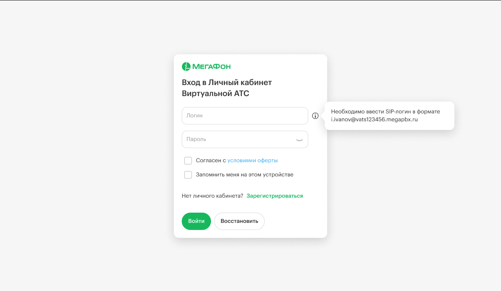
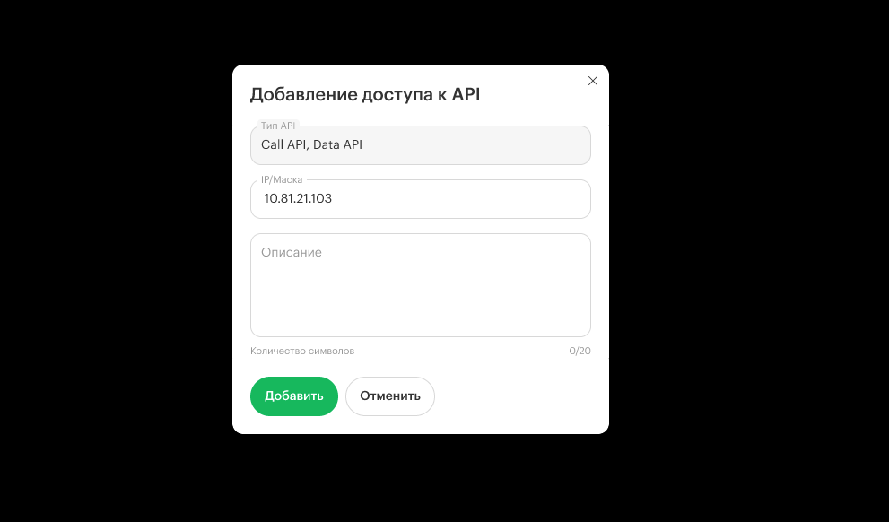

По умолчанию доступ к API запрещен для всех. Чтобы разрешить выполнение запросов, необходимо добавить IP-адрес хоста, с которого осуществляется запрос, в белый список. Это можно сделать через личный кабинет, перейдя в раздел **«Интеграции -> API -> Настройка API»**.

## Инструкция по настройке доступа к API

По умолчанию доступ к API запрещен для всех. Чтобы разрешить выполнение запросов, выполните следующие шаги:

#### **Вход в личный кабинет**

-  Войдите в свой личный кабинет.

#### **Переход в раздел интеграций**:

-  Найдите и выберите раздел **«Интеграции»**.

   [image:./dobavlenie-ip-adresa-v-spisok-razreshennykh-2.png:::0,0,100,100:square,0,47.1461,20.7812,5.42005,Найдите и выберите раздел «Интеграции»,top-left]

   [image:./dobavlenie-ip-adresa-v-spisok-razreshennykh-3.png:::0,0,100,100:square,0.626717,43.6509,14.1667,5.32995,,top-left,&square,95.6044,1.52086,4.43485,7.99492,,top-left]

Затем щёлкните на кнопку API.

#### **Настройка API**

[image:./dobavlenie-ip-adresa-v-spisok-razreshennykh-4.png:::0,0,100,100:square,82.9412,24.7935,16.2157,12.6022,,top-left]

-  В разделе **«Настройка API»** найдите кнопку **«Добавить доступ»**.

Нажмите на нее, чтобы добавить IP-адрес.

#### **Добавление IP-адреса**

-  Введите IP-адрес хоста, с которого будет осуществляться запрос.

-  Если вы хотите разрешить запросы с любого IP-адреса, укажите 0.0.0.0/0.

-  Подтвердите изменения, нажав кнопку “Добавить”.

Теперь ваш IP-адрес добавлен в белый список, и вы сможете выполнять запросы к API.