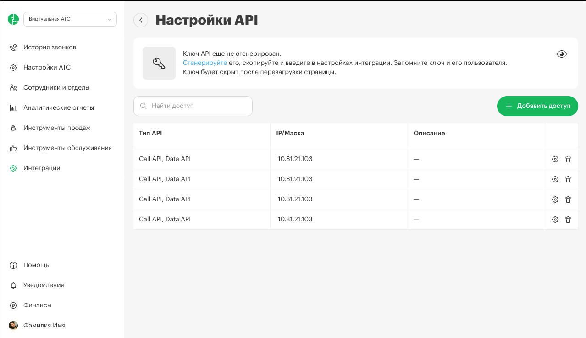
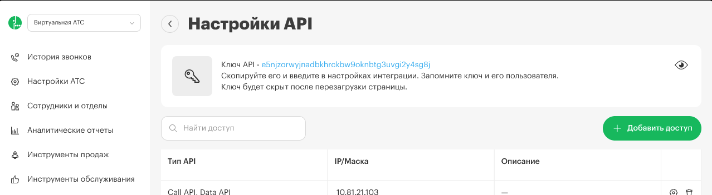

### Инструкция по созданию токена API

#### **Вход в личный кабинет**

[image:./sozdanie-tokena-call-api-5.png:::0,0,100,100:square,0,46.4706,19.2969,6.43415,,top-left]

-  Перейдите в раздел «Интеграции».

#### **Откройте настройки API**

-  Выберите пункт «API».

   [image:./dobavlenie-ip-adresa-v-spisok-razreshennykh-6.png:::0,0,100,100:square,0.626717,43.6509,14.1667,5.32995,,top-left,&square,95.6044,1.52086,4.43485,7.99492,,top-left]

-  Нажмите на «Настройка API».

   

#### **Генерация токена**

-  Найдите кнопку «Сгенерировать» и нажмите на нее.

   [image:./sozdanie-tokena-call-api-2.png:::0,0,100,100:square,30.0421,31.7408,9.81761,11.5274,,top-left]

-  После нажатия будет выдан ваш токен.

   

**Скопируйте токен.**

Просто кликните на токен, чтобы скопировать его в буфер обмена.

:::note 

После обновления страницы или выхода из раздела токен будет скрыт, и вы не сможете его повторно увидеть. Если вы забыли токен, вы можете сгенерировать новый, но учтите, что старый токен перестанет работать.

:::