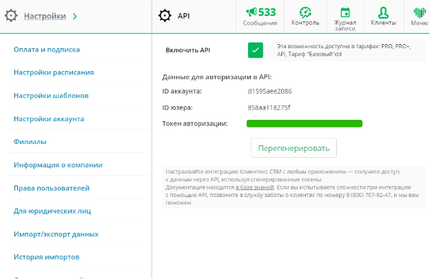

## Интеграция с  Клиентикс CRM  

Решение позволяет интегрировать функционал телефонии и передавать данные по звонкам из нашего ЛК в  Клиентикс CRM.  

**Возможности интеграции**   

- всплывающая карточка клиента при входящем звонке;
- история телефонных вызовов;
- прослушивание записи разговора из CRM;
- исходящий звонок по клику из CRM.

 
 
 

**Важно**: в Клиентикс CRM необходимо подключить один из тарифов "PRO+" или "APIdd"   
  
 
## Подключение интеграции   
 
1.Заполните **учетные данные**.   

Для авторизации в Клиентикс и дальнейшей возможности совершать запросы к API, необходимо добавить :
- название
- account_id,  user_id и access_token от Клиентикс : Меню → Настройки → API

 

2.  **Активируйте** интеграцию.  

3.  Нажмите **сохранить**  
4.  **Настройка исходящих звонков**   

- Скопируйте код из поля **Данные виджета (в JSON)**  и перейдите в кабинет Клиентикс.  
- В меню Клиентикс войдите в раздел **Настройки**.  
- Перейдите в раздел **Виджеты**, поставьте галку в поле **Включить виджеты** и в разделе **Виджеты IP-телефонии** выберите **МегаФон**  

**тут заменить скрин на мегафон, когда появится приложение!!!**

 

- Во всех трёх виджетах в поле «Данные виджета (в JSON)» вставьте скопированный код из кабинета МегаФон.  
- Нажмите **Сохранить**.  

Пример заполнения  

 
 
5.  **Настройка сотрудников**  

Сотрудники не копируются автоматически из одного сервиса в другой. Это значит, что сотрудники должны быть созданы вручную и в личном кабинете МегаФон, и в сервисе Клиентикс.   

- В личном кабинете МегаФон обязательно укажите внутренний номер у всех сотрудников.  
- Войдите в Клиентикс под ролью «Владелец», в новом окне откройте **[ссылку](https://klientiks.ru/clientix/admin/dynamicFields)** и добавьте поля:  
  
  - **Имя поля(техническое)**: itool_labs_voip_internal_number  
   **Название поля**: Внутренний номер сотрудника  
   **Модель**: Сотрудники  
   **Сценарий**: editEmployee  
   **Тип поля**: Текстовая строка(text)    

  - **Имя поля(техническое)**: itool_labs_voip_internal_number  
     **Название поля**: Внутренний номер сотрудника  
     **Модель**: Сотрудники  
     **Сценарий**: edit  
     **Тип поля**: Текстовая строка(text)  

  - **Имя поля(техническое)**: itool_labs_voip_internal_number      
      **Название поля**: Внутренний номер сотрудника  
      **Модель**: Сотрудники  
      **Сценарий**: editOwner  
      **Тип поля**: Текстовая строка(text)  
     

     

Пример заполнения:
   

 

 -  В меню Клиентикс, раздел **Сотрудники** задайте всем требуемым сотрудникам те же внутренние номера, что указывали в кабинете МегаФон.  

 

Для проверки работы интеграции на тестовых звонках проверьте работы пунктов указаных в **Возможности интеграции**.  
Если после всех настроек звонки в Клиентикс не появляются, проверьте, совпадают ли внутренние номера сотрудников в Клиентикс и МегаФон.
