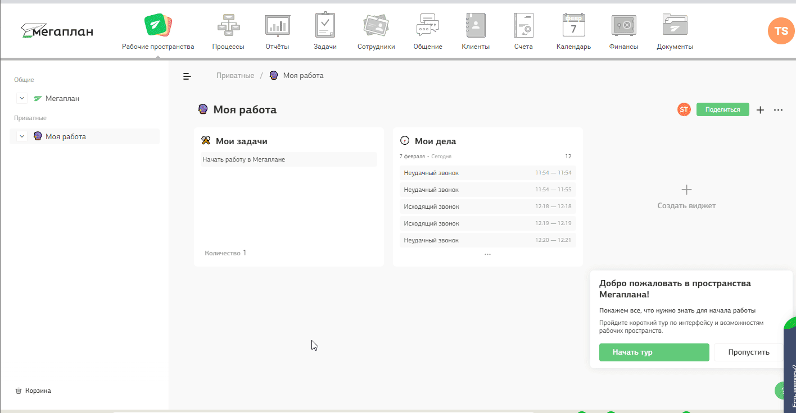

## Интеграция с Мегаплан   

Решение позволяет интегрировать функционал телефонии и  передавать данные по звонкам из нашего ЛК в Мегаплан.  

**Возможности интеграции**   
- всплывающие уведомления о входящих и исходящих звонках;
- сохранение истории и записей звонков в Мегаплан;
- автоматическое создание нового контакта;
- звонок в один клик из Мегаплан;
- возможность завершить звонок из веб-телефона Мегаплан по кнопке "Завершить";
- возможность создавать коммуникации по выбранным типам звонков;
- переадресация на ответственного из CRM при настройке соответственного сценария в ЛК.
 

## Подключение интеграции   

1. Укажите **Учетные данные**  
Для авторизации в мегаплан необходимо: 
- если ранее добавляли учетные данные Мегаплан, то выбрать их из списка,
- если нет, то нажать "Добавить учетные данные" и заполнить значения:
  - название;
  - логин(username) и пароль(password) от Мегаплан;
  - домен Мегаплан в формате YOURDOMAIN.megaplan.ru, часть 'YOURDOMAIN' у каждого клиента уникальна.
   
    
После добавления учетных данных на странице появятся **Параметры интеграции**.  

2. Активируйте интеграцию.  

3. **Фильтровать по виртуальным номерам** - выберите настройку, если требуется фильтрация по виртуальным номерам (в случае подключения нескольких интеграций CRM).   
   
При прожатии будет выведена дополнительная настройка с выбором виртуальных номеров.   

**Список виртуальных номеров** - укажите виртуальные номера, по которым необходимо отображать данные по звонкам в Мегаплан в подключенной сети.   

4. **Ответственный по умолчанию** - менеджер, который будет устанавливаться ответственным за звонки, в которых не было сотрудника.   

5. Выберете дополнительный функционал интеграции, при необходимости: 
- включить переадресацию на персонального менеджера;   

**Важно:** переадресация на персонального менеджера из CRM будет работать при настроенном сценарии с соответствующей операцией в ЛК МегаФон , а также при соответствии внутренних номеров сотрудников в МегаФон и в разделе приложении в Мегаплан (подробнее в п.6).  

- при входящем звонке с неизвестного номера в Мегаплан будет создан новый клиент;
- при исходящем звонке на неизвестный номер в Мегаплане будет создан новый контакт;
- создавать коммуникацию по звонку;
- история звонков сотрудников компании, не присутствующих в Мегаплан, будет сохранена от имени выбранного пользователя.

   

6. В Мегаплан выполните настройку телефонии:    

a. Подключите приложение МегаФон     
- Под пользователем, который входит в группу «Директора» или «Админы», зайдите в личный кабинет Мегаплан.
- В аккаунте выберите раздел «Маркет приложений» - > «Магазин интеграций».
- Найдите приложение «МегаФон 2.0» в категории «Телефония» и установите его.
- После установки необходимо авторизоваться в личном кабинете МегаФон под администратором.
Далее вас переадресует на маркетплейс МегаФон.
    
**скрин добавить после публикации**
  

b. Подключите расширение   

Теперь необходимо указать для каждого пользователя Мегаплан внутренний номер виртуальной АТС МегаФон.   

- Для этого перейдите в раздел “Настройки”, откройте вкладку “Интеграция”, в меню слева выберите пункт “Телефония”.
- Подключите расширение “Подключение к телефонии по API” и там выберете “Настройки телефонии”.
- Перейдите на вкладку  “Пользователи”.
- Добавьте всех пользователей, использующих телефонию. Для каждого из них укажите внутренние номера АТС из раздела "Сотрудники".
- Нажмите сохранить.
  

  
 
**Важно:** если сотрудник не будет указан в данном разделе или внутренний номер не будет соответствовать номеру сотрудника из АТС, функционал поднятия карточки звонка и передача информации по нему не будет доступен.   

7. В настройках интеграции в МегаФон нажмите кнопку "Синхронизировать настройки телефонии из Мегаплан".   

8. Нажмите **Сохранить**.   

Для проверки работы интеграции на тестовых звонках проверьте работу пунктов указаных в **Возможности интеграции**.
   
   
