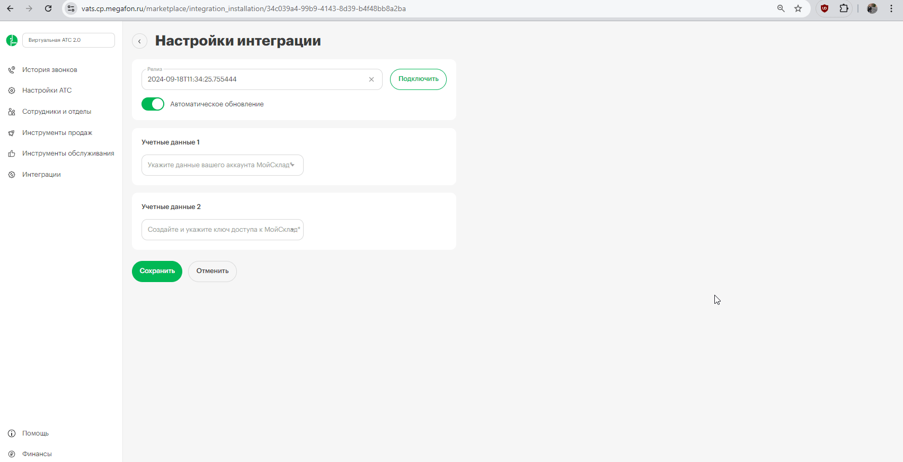

## Интеграция с МойСклад  

Решение позволяет интегрировать функционал телефонии и передавать данные по звонкам из нашего ЛК в МойСклад.  

**Возможности интеграции**   

- всплывающие уведомления о звонках;
- статистика и запись разговора;
- звонок в один клик из CRM.

 
 
 

## Подключение интеграции    

1.Заполните **учетные данные**.   

- Укажите логин и пароль от аккаунта МойСклад, а также название учетных данных.   
- Создайте и укажите ключ доступа (Token) к МойСклад (описание получения ключа в п.3)  

  

После добавления учетных данных на странице появятся **Параметры интеграции**.   
 
2. Активируйте интеграцию.
3. Подключите в МойСклад приложение Виртуальная АТС МегаФон 2.0.

 - Перейдите в раздел **Приложения** -> **Магазин приложений**.
 - В открывшемся разделе найдите **Виртуальная АТС МегаФон 2.0** и нажмите Установить.
 - В появившемся окне настроек:  
   - В поле **Адрес провайдера телефонии** вставьте URL из поля **Webhook URL** из наших настроек.
   - Нажмите кнопку **Создать новый ключ доступа** и скопируйте ключ из поля **Ключ доступа** (его необходимо добавить в учетных данных в п.1).
   - Введите внутренние номера сотрудников, соответствующие внутренним номерам в Личном кабинете Megafon.
   - Прожмите **Установлено**.
   - Сохраните настройку.  
   

4. Выберете дополнительный функционал интеграции, при необходимости  
- можно фильтровать передачу звонков в CRM по виртуальным номерам; 
- после звонка с участием неизвестного номера (входящего успешного и неуспешного) может быть автоматически создан новый контрагент;
- звонки от существующих контрагентов могут автоматически перенаправляться на персональных менеджеров;
- можно включить автоматическую смену ответственного за контрагента при переводе входящего звонка.

 

5. Нажмите сохранить.  

 

Для проверки работы интеграции на тестовых звонках проверьте работу пунктов указаных в **Возможности интеграции**.
    
