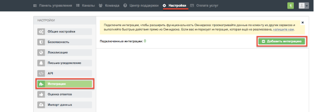
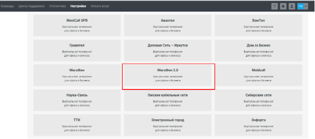
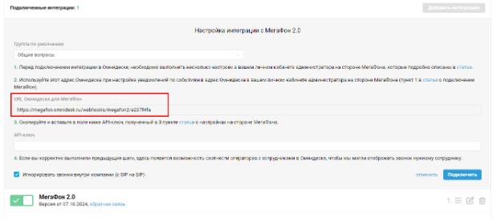
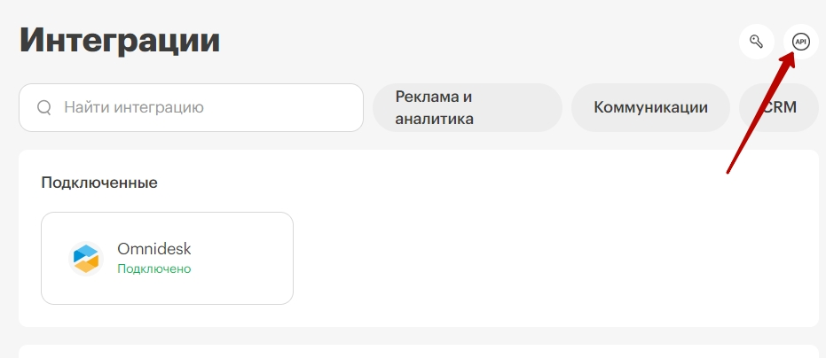
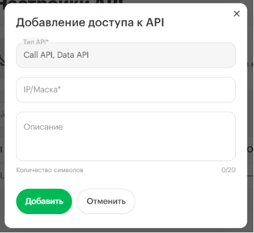
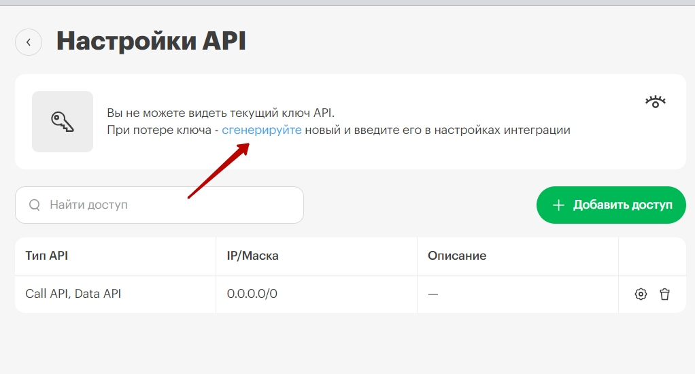
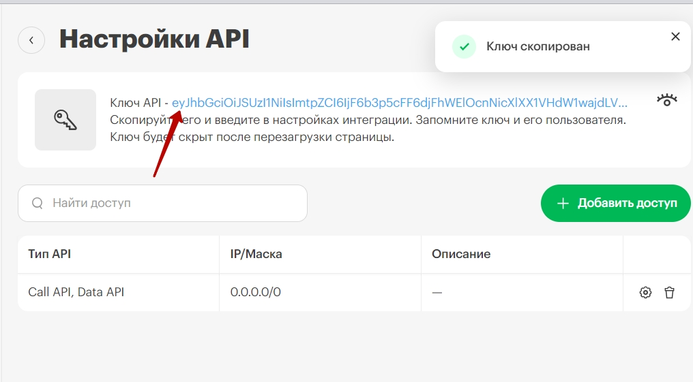

## Интеграция с Омнидеск   

Решение позволяет интегрировать функционал телефонии и  передавать данные по звонкам из нашего Личного кабинета в Омнидеск.    

**Возможности интеграции**   
- уведомление о входящем вызове;  
- автоматическое открытие профиля пользователя при входящем звонке;  
- создание обращений при входящем звонке от неизвестного пользователя;
- создание обращений при пропущенных звонках;  
- исходящий звонок по клику.  
 

## Подключение интеграции  

1. В Омнидеск зайдите в аккаунт администратора, перейдите в Настройки - Интеграции, нажмите Добавить интеграцию.  

  

Найдите виджет МегаФон 2.0 и нажмите на него. 

  

После подключения появятся настройки интеграции. Скопируйте "URL Омнидеска для МегаФон", потребуется в п.3.

  

2. Перейдите в МегаФон и активируйте интеграцию .  

3. Заполните поле URL Омнидеска.  

4. Нажмите **Сохранить**.  

5. Сгенерируйте ключ API в МегаФон:

- перейдите в раздел настройки API;   

  

- нажмите **Добавить доступ** и в раскрывшемся модальном окне в поле **IP/Маска** пропишите 0.0.0.0/0 в качестве ip-адреса;
- нажмите **Добавить**;  

  

- в общем разделе **Настройки API** нажмите на кнопку **сгенерируйте**, после этого будет выведен ключ API;   

  

- нажмите на него, и он будет скопирован в буфер обмена.  

  

6. Скопированный ключ вставьте в Омнидеск в настройках интеграции в поле **API-ключ**  и нажмите **Подключить**.  
После этого появятся дополнительные настройки.
 

7. В этом же разделе в Омнидеск соотнесите сотрудников МегаФон с сотрудниками Омнидеск.  

8.  Еще раз нажмите **Подключить**.  

   

Инструкцию Омнидеск можно найти по [ссылке](https://support.omnidesk.ru/knowledge_base/item/342314)  

Для проверки работы интеграции на тестовых звонках проверьте работу пунктов, указанных в разделе **Возможности интеграции**.  
