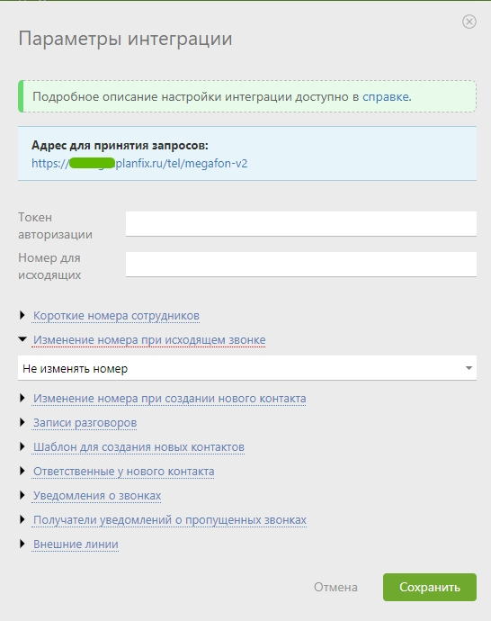

## Интеграция с ПланФикс   

Решение позволяет интегрировать функционал телефонии и  передавать данные по звонкам из нашего ЛК в ПланФикс.    

**Возможности интеграции**   
- передача информации о каждом звонке в ПланФикс;  
- сохранение записей разговоров;  
- открытие карточки клиента при входящем звонке;  
- исходящие звонки по клику на номер из ПланФикс.  
 

## Подключение интеграции   

1. Выполните настройку интеграции в ЛК ПланФикс в соответствии с  **[инструкцией](https://planfix.com/ru/help/%D0%98%D0%BD%D1%82%D0%B5%D0%B3%D1%80%D0%B0%D1%86%D0%B8%D1%8F_%D1%81_%D0%9C%D0%B5%D0%B3%D0%B0%D1%84%D0%BE%D0%BD_2.0)** .  

2. Активируйте интеграцию.   
3. Заполните поле "Адрес для уведомлений". Адрес возьмите из одноименного поля в приложении ПланФикс.  

 

4. **Фильтровать по виртуальным номерам** - выберете настройку, если требуется фильтрация по виртуальным номерам (в случае подключения нескольких интеграций).  
При прожатии, будет выведена дополнительная настройка с выбором виртуальных номеров.  
**Список виртуальных номеров** - укажите виртуальные номера, по которым необходимо отображать данные по звонкам в ПланФикс.  

5. Нажмите **Сохранить**  
 

Для проверки работы интеграции на тестовых звонках проверьте работы пунктов указаных в "Возможности интеграции".  

