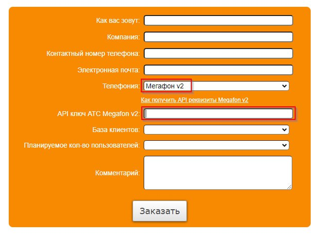
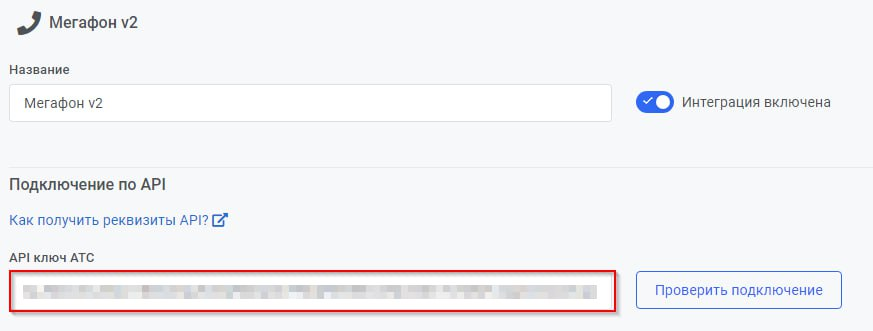

## Интеграция с Простыми звонками   
   
  

**Простые звонки** связывают телефонию **МегаФон** с практически любыми популярными IT-системами, позволяя сервисам обмениваться данными друг с другом.
   
   
 
**Список основных сервисов:**
- 1С ( 1C: УНФ, 1С:ERP , 1С:Управление торговлей и тд);  
- CRM ( SugarCRM, amoCRM, Битрикс24 , Pyrus, Microsoft Dynamics 365 и тд );
- Офисные программы (Microsoft Office , Google Контакты, Google Таблицы и тд  );

Полный список сервисов, возможности интеграций и стоимость услуг можете найти по **[ссылке](https://prostiezvonki.ru/)**
  
 

**Основные возможности интеграции**   
- всплывающая карточка клиента при входящем звонке;  
- исходящий звонок по клику из клиентской базы;  
- сохранение записей разговоров с клиентами;  
- сбор статистики для анализа эффективности звонков.  
 

## Подключение интеграции   

1. Выполните настройки интеграции в ЛК Простые звонки в соответствии с  **[инструкцией](https://prostiezvonki.ru/kb/pbx/nastroyka-megafon-v2)**.  

**Важно**: если у вас еще не подключен сервис, оставьте заявку на сайте Простых звонков в форме демо-версии.  

2. Активируйте интеграцию в МегаФон.   

3. Укажите адрес, скопированный в п.1. в поле **Адрес АТС-коннектора**.   

4. Нажмите **Сохранить**.  

5. Сгенерируйте ключ API в МегаФон:

- перейдите в раздел **Настройки API**;   

  

- нажмите **Добавить доступ** и в открывшемся окне укажите **IP-адреса** стороннего сервиса (146.185.208.14, 89.208.228.117, 84.23.52.159 – под каждый создается отдельный доступ), нажмите **Добавить**;  

  

- в общем разделе **Настройки API** нажмите на **сгенерируйте**, после этого будет выведен ключ API;  

  

- нажмите на него, и он будет скопирован в буфер обмена.  

  

6. Скопированный ключ вставьте в Простые звонки в поле **API ключ АТС Megafon v2**  в форме демо-версии,  

  

либо в уже настроенной интеграции в личном кабинете Простых звонков: **Интеграция - Телефония - Мегафон v2**  

  

 

Для проверки работы интеграции на тестовых звонках проверьте работу пунктов, указанных в разделе **Основные возможности интеграции**.  
