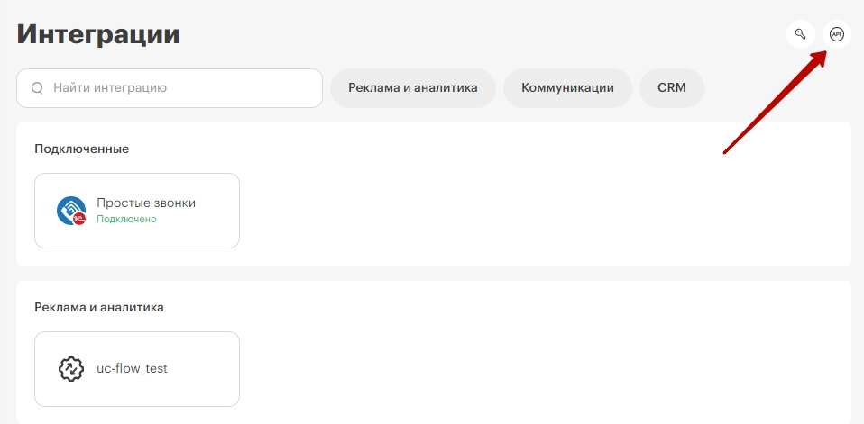
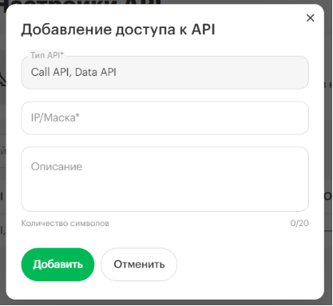
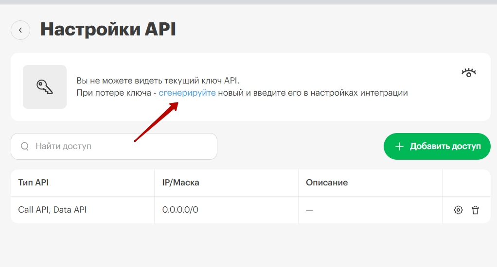
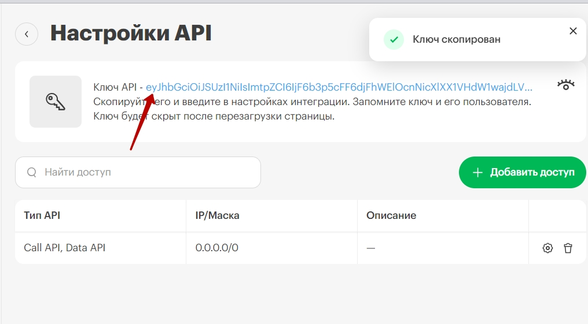

## Интеграция с Простыми звонками   
   
  

**Простые звонки** - связывает телефонию МегаФон с практически любыми популярными IT-системами, позволяя сервисам обмениваться данными друг с другом.
   
   
 
Список основных сервисов:
- 1С ( 1C: УНФ, 1С:ERP , 1С:Управление торговлей и тд);  
- CRM ( SugarCRM, amoCRM, Битрикс24 , Pyrus, Microsoft Dynamics 365 и тд );
- Офисные программы (Microsoft Office , Google Контакты, Google Таблицы и тд  );

Полный список сервисов, возможности интеграций и стоимость услуг можете найти по **[ссылке](https://prostiezvonki.ru/)**
  
 

**Основные возможности интеграции**   
- всплывающая карточка клиента при входящем звонке;  
- исходящий звонок по клику из клиентской базы;  
- сохранение записей разговоров с клиентами;  
- сбор статистики для анализа эффективности звонков.  
 

## Подключение интеграции   

1. Выполните настройки интеграции в ЛК Простые звонки в соответствии с  **[инструкцией](тут укажу после публикации инструкции на сайте планфикс)** .  

2. Активируйте интеграцию в МегаФон.   

3. Заполните поле "Адрес АТС-коннектора". Адрес возьмите из одноименного поля в сервисе **Простые звонки**.   
тут запросить скрин
 

4. Нажмите **Сохранить**.  

5. Сгенерируйте ключ API в МегаФон:

- перейдите в раздел настройки API;   

  

- нажмите Добавить доступ и в открывшемся окне укажите IP адрес стороннего сервиса (146.185.208.14, 89.208.228.117, 84.23.52.159 – под каждый создается отдельный доступ), нажмите Добавить;  

  

- в общем разделе Настройки API нажмите на сгенерируйте,  

  

после будет выведен ключ API. Нажмите на него и он будет скопирован в буфер.  

  

6. Скопированный ключ вставьте в Простые звонки в соответствии с инструкцией из п.1
скрин

 

Для проверки работы интеграции на тестовых звонках проверьте работы пунктов указаных в **Возможности интеграции**.  
