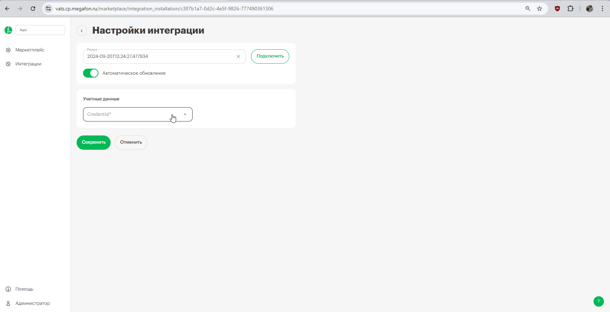

## Интеграция с  RetailCRM  

Решение позволяет интегрировать функционал телефонии и передавать данные по звонкам из нашего Личного кабинета в RetailCRM.  

**Возможности интеграции**   

- всплывающие уведомления о входящих звонках;
- звонок в один клик из RetailCRM;
- сохранение истории и записей звонков в RetailCRM.

 
 
 

## Подключение интеграции   

1. Укажите **Учетные данные**  

- если ранее добавляли учетные данные RetailCRM, то выберите их из списка;
- если нет, то нажмите **Подключить учетную запись** и заполните значения:
    - название;
    - URL (домен RetailCRM ) в формате YOURDOMAIN.retailcrm.ru , часть 'YOURDOMAIN' у каждого клиента уникальна;
    - API key - ключ API RetailCRM (Настройки - > Интеграция → Ключи доступа к API -> Добавить).   
    
Создайте новый ключ с доступом ко всем магазинам и методам. Добавьте данный ключ в настройки интеграции.  

  

 

После добавления учетных данных на странице появятся **Параметры интеграции**.

 

2. **Фильтровать по виртуальным номерам** - выберите настройку, если требуется фильтрация по виртуальным номерам (в случае подключения нескольких интеграций CRM).   

При нажатии будет выведена дополнительная настройка с выбором виртуальных номеров.  

**Список виртуальных номеров** - укажите виртуальные номера, по которым необходимо отображать данные по звонкам в RetailCRM.   

3. **Сопоставьте пользователей** - укажите соответствие сотрудников из RetailCRM и МегаФон.   

4. **Ответственный по умолчанию** - если звонок потерян или поступил на сотрудника, который отсутствует в RetailCRM, то выбранный сотрудник будет назначен ответственным при автоматическом создании контакта. 

5. Выберите дополнительный функционал обработки звонков, при необходимости:   

- включить переадресацию на персонального менеджера;  

**Важно**: переадресация на персонального менеджера из CRM будет работать при настроенном сценарии с соответствующей операцией в ЛК МегаФон, а также при настроенном сопоставлении в п.3.   

 - создавать контакт при исходящем звонке на неизвестный номер;  

 - создавать контакт при входящем звонке с неизвестного номера.

  

6. Заполните сопоставление магазинов в RetailCRM и виртуального номера АТС .    
Это потребуется при создании контакта и отображения магазина в статистике по звонкам.  

7. Активируйте интеграцию.   

8. Нажмите **Сохранить**

Для проверки работы интеграции на тестовых звонках проверьте работу пунктов, указанных в разделе **Возможности интеграции**.
