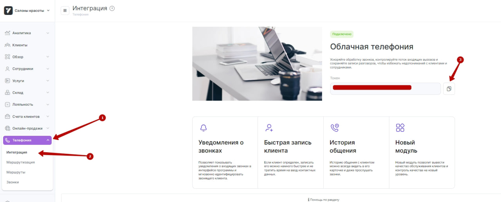
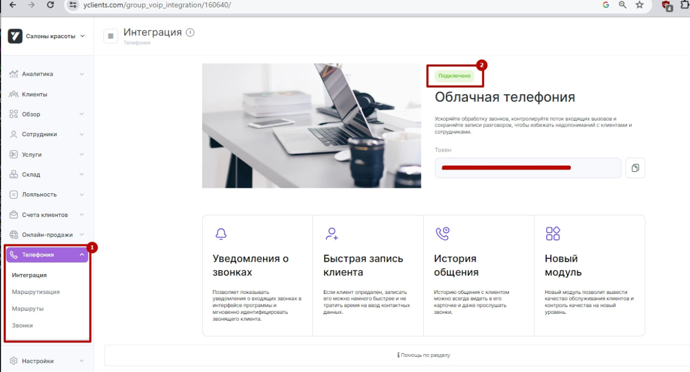
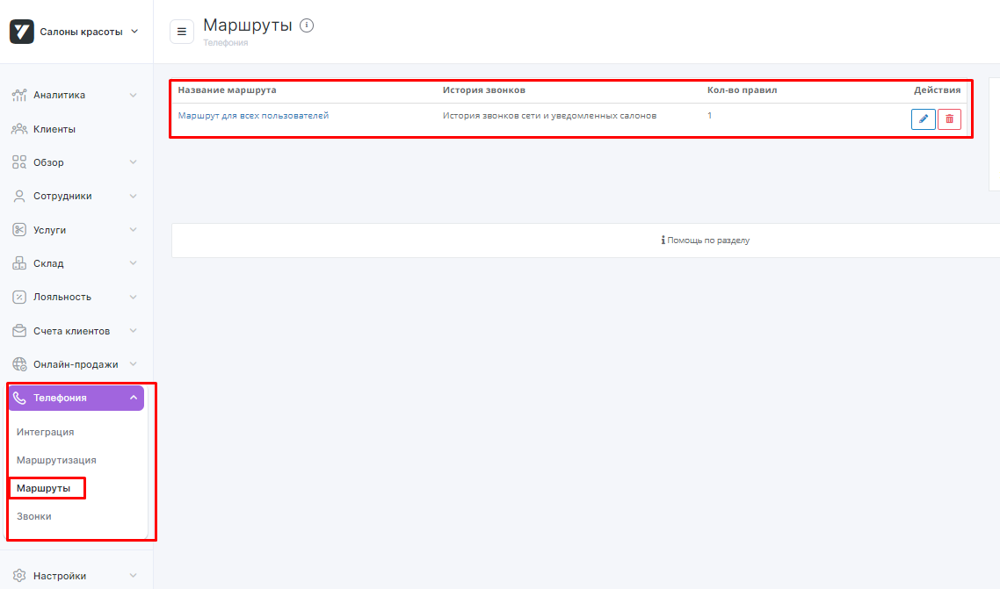
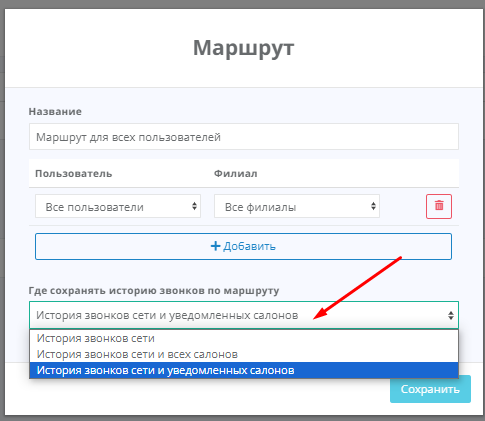
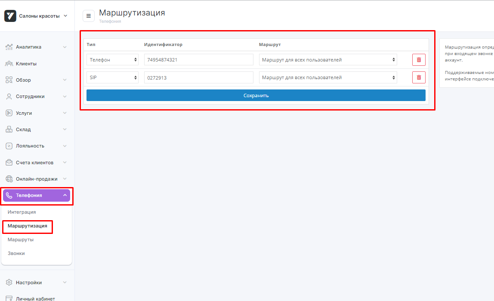

## Интеграция с Yclients   

Решение позволяет интегрировать функционал телефонии и передавать данные по звонкам из нашего Личного кабинета в Yclients.  

**Возможности интеграции**   

- всплывающие уведомления о входящих звонках;
- сохранение истории и записей звонков в Yclients;
- возможность звонить в один клик из карточки клиента с помощью расширения для браузера Chrome, которое можно установить по **[ссылке](https://softphone-widget-iframe.cp.megafon.ru/chrome.zip)**.  

 
 
 

## Подключение интеграции   

1. Укажите **Учетные данные**  

- если ранее добавляли учетные данные Yclients, то выберите их из списка;
- если нет, то нажмите **Подключить учетную запись** и заполните значения:
  - название - укажите произвольное название (желательно название сети), оно будет выведено в списке подключений Yclients;
  - **User token** из Yclients в поле Yclients CRM Token.  

**Как получить User token:**  зайдите в **Сеть** (левый верхний угол), с которой подключаете интеграцию, и перейдите в раздел **Телефония -> Интеграция**, скопируйте значение из поля **Токен**.   

  

После добавления учетных данных на странице появятся **Параметры интеграции**.   

2. Нажмите **Интеграция активна** на этой странице.   

3. **Фильтровать по виртуальным номерам** - выберите настройку, если требуется фильтрация по виртуальным номерам (в случае подключения нескольких сетей/интеграций CRM).   

При нажатии будет выведена дополнительная настройка с выбором виртуальных номеров.    

**Список виртуальных номеров** - укажите виртуальные номера, по которым необходимо отображать данные по звонкам в Yclients в подключенной сети.   

4. Нажмите **Cохранить**.   

5. В кабинете Yclients, после проведенных настроек, появятся дополнительные разделы в блоке **Сеть –> Телефония**: Маршрутизация, Маршруты и Звонки (1), а статус интеграции изменится на **Подключено** (2).    

 

6. В Yclients перейдите в раздел **Маршруты** и выстройте маршрут, по которому будут идти звонки.   
Маршрут по умолчанию всего один – Маршрут для всех пользователей.   
Настройка маршрута по умолчанию – сохранять историю звонков по маршруту в Истории сети.  

   

Кликните, чтобы открыть настройки.  

  

При такой настройке всплывающие уведомления о звонках работать не будут, а звонки будут видны только в истории звонков сети.   
**Измените настройку** на ту, которая вам подходит:  
  - история звонков сети и всех салонов – всплывающее окно о звонке будет появляться во всех филиалах сети, звонок будет виден во всех филиалах в разделе Обзор – Звонки. 
  - история звонков сети и уведомленных салонов – всплывающее окно о звонке будет появляться в том филиале/филиалах, которые будут выбраны в этом маршруте.  

7. После настройки маршрута свяжите его с номером телефона/идентификатором абонента телефонии, sip или внутренний номер сотрудника, на который поступают звонки.  
Для этого перейдите в раздел **Маршрутизация**.
   
Укажите номер телефона своей компании без плюса, скобок, дефисов, пробелов и других символов и сохраните.  

**Настройка в  Yclients завершена**.  
    

Для проверки работы интеграции на тестовых звонках проверьте работу пунктов, указанных в  разделе **Возможности интеграции**.  
Если после всех настроек звонки в Yclients не появляются, проверьте, совпадают ли номера телефонов в маршрутизации Yclients и в Личном кабинете МегаФон.

